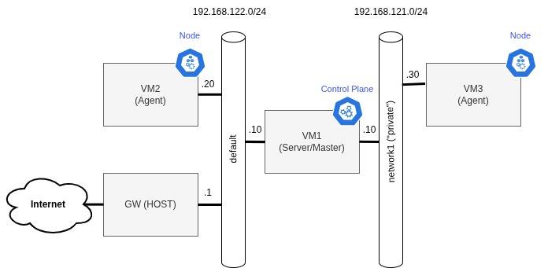

Before starting

- Follow setup instructions in the original repository from [a-mt](https://github.com/a-mt/terraform-kvm)


- (Recommended) Additionally add the following line to your .bashrc/.zshrc to connect the user to Qemu system instance
```bash
export LIBVIRT_DEFAULT_URI='qemu:///system'
```

Depending on your system specifications and your lab setup, you may need to resize the ubuntu image:
```bash
# For example
qemu-img resize jammy-server-cloudimg-amd64.img 20G
```

- (Optional) Create a KVM virtual NAT network for nftable labs.
```bash
cp /etc/libvirt/qemu/networks/default.xml /etc/libvirt/qemu/networks/network1.xml
# Modify the network1.xml so it matches the subnet shown in the figure
virsh net-define  /etc/libvirt/qemu/networks/network1.xml
virsh net-start network1
virsh net-autostart network1

#Check the configuration
virsh net-list --all && virsh net-dumpxml network1
```

## Repository setup

Navigate to different branches to see different lab setups for terraform on kvm.
- [lab-k3s](https://github.com/rapires96/terraform-kvm-cluster/tree/lab-k3s): set up k3s cluster with terraform + ansible
- [lab-nftables](https://github.com/rapires96/terraform-kvm-cluster/tree/lab-nftables): experiment with nftables using VM1 as a KVM network router.

