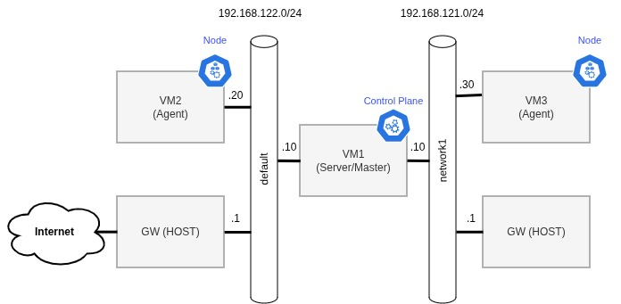

# Terraform KVM cluster



Before starting

- Follow setup instructions in the original repository from [a-mt](https://github.com/a-mt/terraform-kvm)

- (Recommended) Additionally add the following line to your .bashrc/.zshrc to connect the user to Qemu system instance
```bash
export LIBVIRT_DEFAULT_URI='qemu:///system'
```
- Depending on your system specifications and your lab setup, you may need to resize the ubuntu image:
```bash
# For example
qemu-img resize jammy-server-cloudimg-amd64.img 20G
```

### Setup

1. Required ansible and terraform

2. Boot the VMs.
```bash
terraform plan
terraform apply
```

3. run the ansible playbook
```bash
export ANSIBLE_SSH_KEY=/path/to/ssh/private/key
cd ansible/
ansible-playbook -i inventory.yaml playbook.yaml
```

